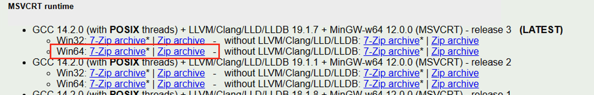

# About

LLVM obfuscation is a LLVM pass plugin, used to apply transformation on [LLVM assembly language](https://llvm.org/docs/LangRef.html) to provide obfuscation.

All credit goes to eShards and Forta for the implementation. I just updated 3 lines of code and wrote an exshaustive README.md file. The projects can be found below: <br>

https://github.com/eshard/obfuscator-llvm <br>
https://github.com/Cobalt-Strike/obfuscator-llvm

# Installation for Windows

To build this plugin you need to build LLVM. Refer to the [documentation](https://llvm.org/docs/CMake.html) for more information. 

### Install Ninja, Cmake, Python, and Mingw w/ Winlibs (Recommended)
Navigate to [Winlibs](https://winlibs.com) and install the latest release of GCC + LLVM/Clang + Mingw <br>



Once installed, unzip the archive and move the directory to your preferred location. I recommend installing it in C:\mingw, as that’s what I use, and it will be easier to follow along.
### Add install to PATH

To quickly access the System Properties in Windows to add or edit PATH variables, you can follow these steps:

1. Press Windows + R to open the Run dialog.
2. Type `sysdm.cpl` and hit Enter.

This will open the System Properties window. From there:

3. Go to the **Advanced** tab.
4. Click on the **Environment Variables** button.
5. Under **System variables**, scroll down and select the **Path** variable, then click **Edit** to add or modify entries.
6. Add the location of your mingw folder to Path.

### Check your Clang version number.
To check the version of `clang` in your system using PowerShell, follow these steps:

1. Open **PowerShell** (Press `Windows + X` and choose **Windows PowerShell** or **Windows Terminal**).
2. Type the following command and press Enter:

    ```powershell
    clang.exe --version
    ```

You should see output similar to this:
```bash
(built by Brecht Sanders, r3) clang version 19.1.7 Target: x86_64-w64-windows-gnu Thread model: posix InstalledDir: C:/mingw64/bin PS C:\Users\dev>
```

## Install LLVM
### Install LLVM from your Clang version.
My Clang version is 19.1.7, so I'll be using that.
```powershell
# Obfuscator is your project; we'll use this for the LLVM & llvm-obfuscator directoreis.
mkdir Obfuscator 
cd ./Obfuscator/
git clone --depth 1 --branch llvmorg-19.1.7 https://github.com/llvm/llvm-project.git
```

### Navigate to the LLVM directory and create a build directory.
```powershell
cd llvm-project
mkdir build
cd build
```

### Run Cmake to setup LLVM install
```powershell
cmake -G "Ninja" `
    -DCMAKE_INSTALL_PREFIX="C:\LLVM" `
    -DCMAKE_C_COMPILER="C:\mingw64\bin\x86_64-w64-mingw32-gcc.exe" `
    -DCMAKE_CXX_COMPILER="C:\mingw64\bin\x86_64-w64-mingw32-g++.exe" `
    -DCMAKE_ASM_COMPILER="C:\mingw64\bin\x86_64-w64-mingw32-gcc.exe" `
    -DCMAKE_CXX_STANDARD=17 `
    -DPython3_EXECUTABLE="C:\mingw64\lib\python3.9\venv\scripts\nt\python.exe" `
    -DBUILD_SHARED_LIBS=on `
    -DCMAKE_BUILD_TYPE=Release `
    ..\llvm\

```

### Run ninja install on the LLVM build (this will take a while).
Depending on your hardware, you may want to increment/decrement the number of concurrent jobs (-j1, -j2, -j8)
```
ninja -j1

ninja install
```

## Install LLVM-Obfuscator
### Navigate back to your project directory.
```powershell
cd ..\..
```
### Install LLVM-Obfuscator from this git repo.
```powershell
git clone https://github.com/rottaj/obfuscator-llvm.git
```

### Navigate to the obfuscator-llvm directory and create a build directory.
```powershell
cd obfuscator-llvm 
mkdir build
cd build
```

### Run Ninja Install on llvm-obfuscator build.
```
cmake -G "Ninja" `
    -DLLVM_DIR="C:\LLVM\lib\cmake" `
    -DCMAKE_C_COMPILER="C:\mingw64\bin\x86_64-w64-mingw32-gcc.exe" `
    -DCMAKE_CXX_COMPILER="C:\mingw64\bin\x86_64-w64-mingw32-g++.exe" `
    -DCMAKE_ASM_COMPILER="C:\mingw64\bin\x86_64-w64-mingw32-gcc.exe" `
    -DCMAKE_CXX_STANDARD=17 `
    -DPython3_EXECUTABLE="C:\mingw64\lib\python3.9\venv\scripts\nt\python.exe" `
    -DBUILD_SHARED_LIBS=on `
    -DCMAKE_BUILD_TYPE=Release `
    ..
```

### Run Ninja Install on llvm-obfuscator 
```
ninja -j1
```

### That's it! Try it out!
If everything worked, you'll see a libLLVMObfuscator.dll in the build directory of obfuscator-llvm, which you can use with Clang.
```
clang -fpass-plugin="C:\Users\dev\Obfuscator\obfuscator-llvm\build\libLLVMObfuscator.dll" \
.\main.c -o main.exe
```


If the compilation is successful the plugin is `libLLVMObfuscator.so` and can be used with **clang** (`-fpass-plugin=`) or **opt** (`-load-pass-plugin`).

## Usage
(Taken from original https://github.com/eshard/obfuscator-llvm & https://github.com/Cobalt-Strike/obfuscator-llvm)
### With clang

This plugin can be used with clang's switch `-fpass-plugin` and depending on your llvm version in addition
you may need to specify `-fno-legacy-pass-manager`.

`clang -fno-legacy-pass-manager -fpass-plugin=<path/to/llvm/obfuscation>/libLLVMObfuscator.so hello_world.c -o hello_world`

You can chose to insert passes in the optimization pipeline by setting the following environment variables before running clang:
- LLVM_OBF_PEEPHOLE_PASSES
- LLVM_OBF_SCALAROPTIMIZERLATE_PASSES
- LLVM_OBF_VECTORIZERSTART_PASSES
- LLVM_OBF_PIPELINESTART_PASSES
- LLVM_OBF_PIPELINEEARLYSIMPLIFICATION_PASSES
- LLVM_OBF_OPTIMIZERLASTEP_PASSES

For instance if you want to run the flattening, bogus and substitution passes in that order, you can do:
`export LLVM_OBF_SCALAROPTIMIZERLATE_PASSES="flattening,bogus,substitution,split-basic-blocks"`

Refer to the llvm::PassBuilder documentation for more information on each insertion point.

### With opt

[`opt`](https://llvm.org/docs/CommandGuide/opt.html) can be used to apply specific passes from LLRM-IR you
would pre-generate using `clang`.

```
# pre-generate llvm bytecode
clang -01 -S -emit-llvm hello_world.c -o hello_world.bc

# apply the pass
opt --relocation-model=pic -load-pass-plugin <path/to/llvm/obfuscation>/libLLVMObfuscator.so
-passes="<my-pass-name>" hello_world.bc -o hello_world_obfuscated.bc

# generate an object file with llc
llc --relocation-model=pic -filetype=obj hello_world_obfuscated.bc -o hello_world_obfuscated.o

# generate the binary file with clang
clang hello_world_obfuscated.o -o hello_world_obfuscated
```

## References
https://github.com/eshard/obfuscator-llvm <br>
https://github.com/Cobalt-Strike/obfuscator-llvm

